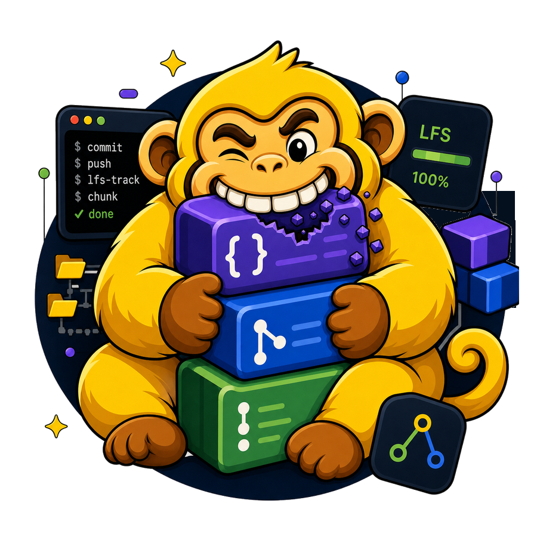
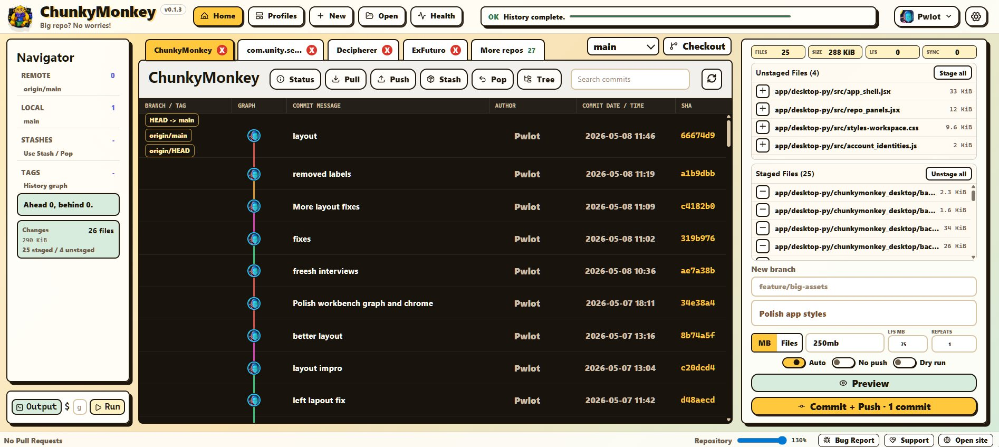

# ChunkyMonkey

<p align="center">
  
</p>

ChunkyMonkey is a Git/LFS desktop app and CLI for large game, ML, media, and research repos.

<p align="center">
  
</p>

Official site: https://chunkymonkey.dev

Docs: https://chunkymonkey.dev/docs

I built it after dealing with huge pushes, Git LFS mistakes, timeouts, and unreliable connections in game and ML projects. It automatically splits large commits into practical chunks, helps catch LFS problems before they hurt, and makes big pushes easier to finish.

## Release

https://github.com/pwlot/ChunkyMonkey/releases/latest

Download the latest uploaded artifact for your system:

- Windows installer: `ChunkyMonkeySetup.exe`
- Windows CLI: `chunkymonkey-cli-windows-x64.zip`
- Linux desktop package: `chunkymonkey-linux-x64.deb`
- Linux desktop tarball: `ChunkyMonkey-linux-x64.tar.gz`
- Linux CLI: `chunkymonkey-cli-linux-x64.zip`

macOS is planned, but it is not published in the current release yet.

Release artifacts include SHA-256 checksums. Windows may show an unknown-publisher warning until signing is configured. The source code is not public yet.

## What it does

- Auto-chunks large commits and pushes into smaller parts.
- Helps avoid push timeouts on slow or unreliable connections.
- Checks Git LFS coverage for large assets, model files, datasets, video, audio, and binaries.
- Shows push/pull progress, speed, ETA, and failure status.
- Scans folders for Git repos and keeps large workspaces manageable.
- Clones repos, creates repos, and works with GitHub accounts through local Git/GitHub tools.
- Shows commit history and branch state.
- Protects branch checkout when the worktree has changes.
- Includes repo health and repair tools for stale remotes, LFS state, repo bloat, cache folders, and generated files.
- Includes templates and helpers for game, ML, media, and research repos.
- Exports diagnostics only when you ask for them.
- Provides both desktop and CLI workflows.
- Offers a one-time Pro upgrade for multi-repo workspace tools, fast account menus, profile workflows, and stronger diagnostics.

## Why it exists

ChunkyMonkey is for repos where pushes fail because the repo is big, binary-heavy, or sitting behind a bad connection:

- Unity, Unreal, Godot, and custom engine projects.
- ML projects with checkpoints, weights, datasets, notebooks, generated artifacts, and experiment output.
- Media projects with large video, audio, image, cache, and export folders.
- Research repos with many generated files and fragile reproduction state.
- Any repo where a normal push can turn into a timeout, LFS mistake, or cleanup session.

## CLI

The CLI and desktop app use the same core logic, so the same workflow is available from either surface.

Typical CLI use:

```bash
chunkymonkey
# 1. Commit + push chunks
# Chunk target? 500mb
# Parts? 4
# Commit message? Add assets
# Preview first? y
# Push? y
```

ChunkyMonkey uses the current Git repo automatically, picks practical chunk sizes, and pushes in smaller pieces so huge commits are less likely to fail halfway through. Slow connection, large assets, bad LFS setup: those are the cases it is built for.

For automation and scripts:

```bash
chunkymonkey status --repo .
chunkymonkey radar --repo .
chunkymonkey ml-report --repo .
chunkymonkey preview --chunk-size 500mb --parts 2
chunkymonkey commit --chunk-size 500mb --parts 2 --message "Add assets"
```

## Release channel

ChunkyMonkey is in an early public release. It is usable, actively improving, and built around local Git workflows.

This public repo is for:

- downloads
- release notes
- checksums
- bug reports
- support docs
- security/contact info

The source code is not public.

## Trust model

ChunkyMonkey shells out to local Git. It does not host your repos, sync private files to a service, or run background telemetry.

Risky operations are explicit. Bug reports are user-triggered. Diagnostics are exported locally unless you choose to send them.

## Source Availability

ChunkyMonkey is distributed through public release artifacts. The source code is not public yet.

## Bugs

Use GitHub Issues:

https://github.com/pwlot/ChunkyMonkey/issues/new

Do not include secrets, tokens, private repo contents, or proprietary files in public issues.

## Support

Support development:

https://www.pwlot.com/#support
