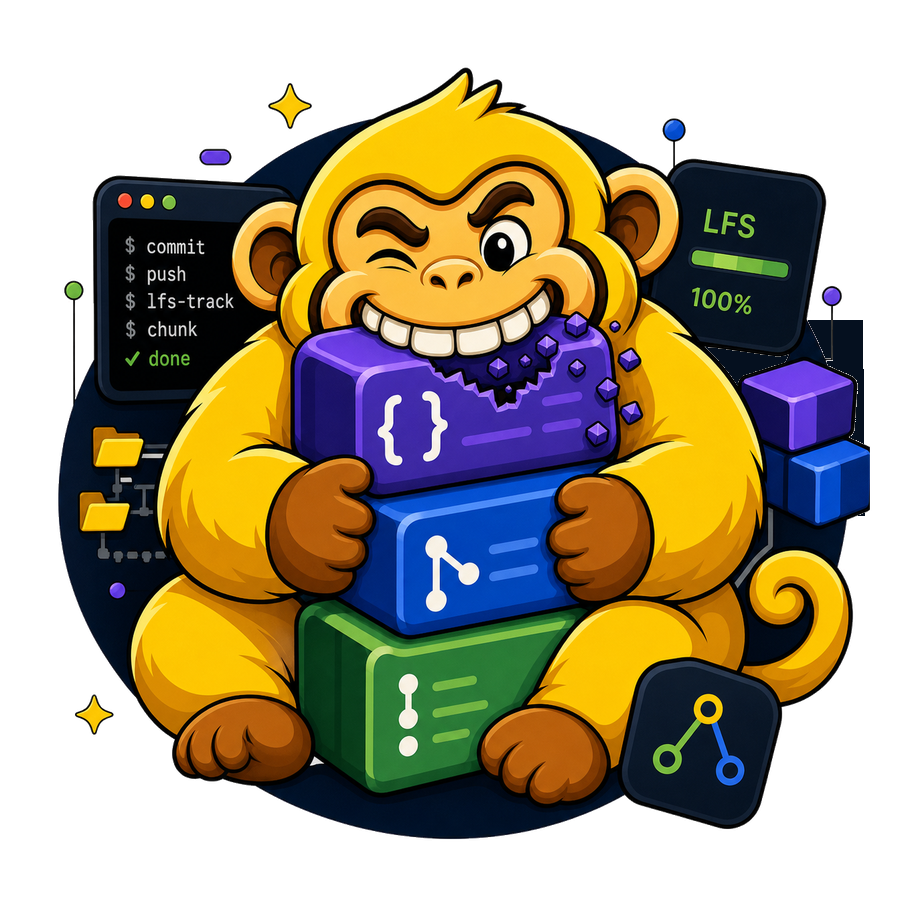

# ChunkyMonkey

<p align="center">
  
</p>

ChunkyMonkey is a Git/LFS desktop app and CLI for large game, ML, media, and research repos.

Official site: [chunkymonkey.dev](https://chunkymonkey.dev)

Docs: [chunkymonkey.dev/docs](https://chunkymonkey.dev/docs)

I built it after dealing with huge pushes, Git LFS mistakes, merge conflicts, timeouts, and unreliable connections in game and ML projects. It splits large commits into practical chunks, catches LFS problems before they hurt, and gives conflict recovery a safer local workflow.

## Release

[Download the latest Windows installer: `ChunkyMonkeySetup.exe`](https://github.com/pwlot/ChunkyMonkey/releases/latest/download/ChunkyMonkeySetup.exe)

ChunkyMonkey currently ships for Windows only. The installer includes the desktop app and CLI. You can also download the [standalone Windows CLI](https://github.com/pwlot/ChunkyMonkey/releases/latest/download/chunkymonkey-cli-windows-x64.zip) and [SHA-256 checksums](https://github.com/pwlot/ChunkyMonkey/releases/latest/download/checksums.txt). Windows may show an unknown-publisher or SmartScreen warning.

## What it does

- Splits large commits and pushes into smaller parts, with progress, speed, ETA, and retry-friendly behavior for slow or unreliable connections.
- Finds large files outside Git LFS, repo bloat, generated folders, cache files, and other asset risks before they become cleanup work.
- Reviews changes side by side and stages, unstages, or checkpoint-discards hunks and selected line blocks.
- Shows visual history, branches, stashes, conflicts, Pull Requests, PR risk, and local recovery points.
- Resolves conflicts in Merge Doctor with base, ours, theirs, and result views, local backups, editor or mergetool handoff, and reviewed actions.
- Opens, scans, clones, and creates repositories while keeping selected GitHub account routes separate.
- Turns mixed changes into Review Prep checkpoints, buckets, commits, branches, risk checks, compare links, and PR handoff.
- Includes local Unity, Unreal Engine, Hugging Face, and MCP Agent add-ons.
- Provides desktop and CLI workflows, local diagnostic export, and in-app updates.

## Built for large repos

ChunkyMonkey is for game projects, model repos, datasets, media work, and research repos where large assets, Git LFS mistakes, or unreliable connections can turn a normal push into a timeout or cleanup session.

## CLI

The Windows installer includes the CLI. Run `chunkymonkey` with no arguments for the guided menu.

Typical CLI use:

```bash
chunkymonkey
# 1. Commit + push chunks
# Chunk target? 500mb
# Parts? 4
# Commit message? Add assets
# Preview first? y
# Push? y
```

For automation and scripts:

```bash
chunkymonkey status --repo .
chunkymonkey radar --repo .
chunkymonkey ml-report --repo .
chunkymonkey preview --chunk-size 500mb --parts 2
chunkymonkey commit --chunk-size 500mb --parts 2 --message "Add assets"
```

## Add-ons

Add-ons are local repo adapters. Settings > Add-ons is for enabling included add-ons, adding local folders, trusting local backend code, refreshing status, and running actions.

Built-ins:

<table>
  <tr>
    <td width="50%" valign="top">
      <br>
      <strong>Hugging Face</strong><br>
      Inspect model, dataset, Space, and Storage Bucket state. Preview bucket sync before writing.
    </td>
    <td width="50%" valign="top">
      <picture>
        <source media="(prefers-color-scheme: dark)" srcset="https://cdn.simpleicons.org/unity/FFFFFF">
        
      </picture><br>
      <strong>Unity</strong><br>
      Find missing <code>.meta</code> files, generated folders, ignore/LFS gaps, and large project assets. Includes the free Unity Editor extension.
    </td>
  </tr>
  <tr>
    <td width="50%" valign="top">
      <picture>
        <source media="(prefers-color-scheme: dark)" srcset="https://cdn.simpleicons.org/unrealengine/FFFFFF">
        
      </picture><br>
      <strong>Unreal Engine</strong><br>
      Find generated folders, large untracked assets, and tracked <code>.uasset</code> or <code>.umap</code> files outside Git LFS.
    </td>
    <td width="50%" valign="top">
      <br>
      <strong>MCP Agent</strong><br>
      Expose repo status, diffs, history, Review Prep, and confirmation-gated Git actions to compatible local MCP clients.
    </td>
  </tr>
</table>

Install ChunkyMonkey Git and LFS Tools from Unity Package Manager:

```text
https://github.com/pwlot/ChunkyMonkey.git?path=addons/unity/EditorPackage
```

Developer docs: [chunkymonkey.dev/docs/add-ons](https://www.chunkymonkey.dev/docs/add-ons.html)

## Release channel

ChunkyMonkey is a public release built around local Git workflows.

This public repo is for:

- downloads
- release notes
- checksums
- support docs
- security/contact info

The source code is not public.

## Trust model

ChunkyMonkey shells out to local Git. It has no repository service and collects no telemetry.

Risky operations are explicit. Git remotes and optional tools run only when you invoke them using the accounts and endpoints you configure. Bug Report opens a prefilled email for your review. Common secrets, absolute local paths, and recognized remote URLs are redacted automatically. Diagnostics stay local unless you attach them yourself.

Discarding a hunk or line block creates a local checkpoint first. Merge Doctor creates local backup sessions before writing a resolved conflict file. It stages only the selected file and does not create a commit automatically. MCP write tools require explicit `confirm=true`. Optional AI assistance uses only the service, API key, and endpoint you configure, and only when you request it. API keys are kept in the OS credential store when available.

## Source Availability

ChunkyMonkey desktop and CLI are distributed through public release files. The Unity Editor package source is visible under `addons/unity/EditorPackage` for inspection and integration, but it is not open-source software and remains covered by the ChunkyMonkey Software License Agreement.

## License

ChunkyMonkey is proprietary software distributed under the [ChunkyMonkey Software License Agreement](LICENSE). It may be installed and used under that agreement, but it may not be redistributed, resold, modified, reverse engineered, or used to build derivative products except where applicable law requires otherwise. Release packages include a copy of the license.

## Support

Use Bug Report inside ChunkyMonkey for product problems. It opens a prefilled email to [p.pachniewski@gmail.com](mailto:p.pachniewski@gmail.com) with the subject `ChunkyMonkey bug report: [your subject]`. Review it before sending. If the app cannot start, send the same email manually.

Support development:

[pwlot.com/#support](https://www.pwlot.com/#support)

Policies: [Terms](https://chunkymonkey.dev/legal#terms) | [Refunds](https://chunkymonkey.dev/legal#refunds) | [Privacy](https://chunkymonkey.dev/legal#privacy)
